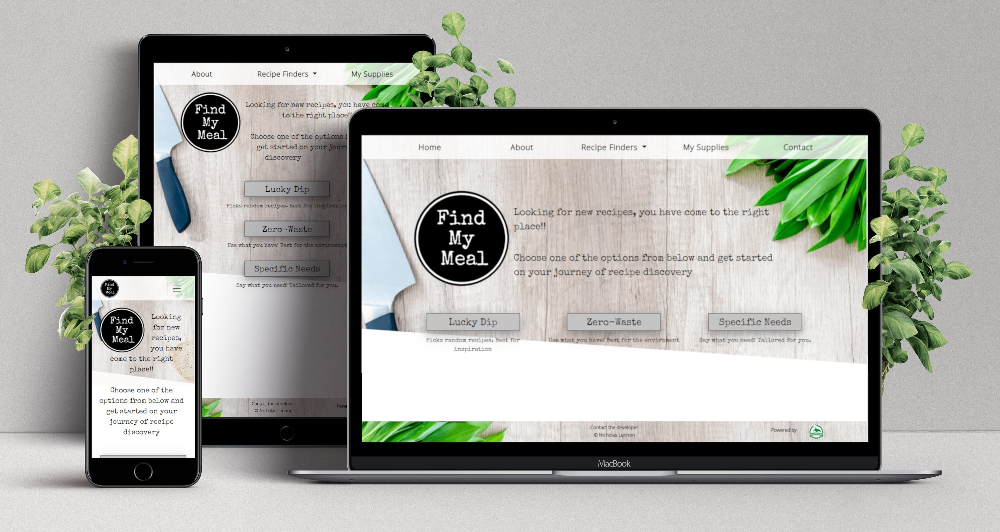
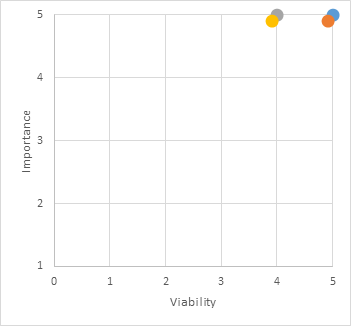
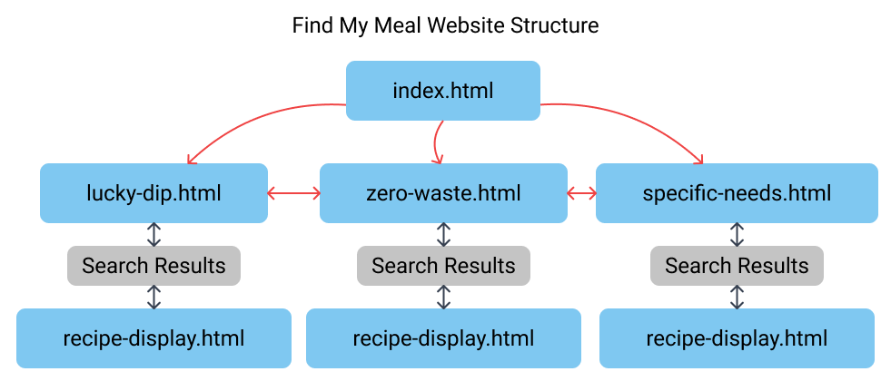
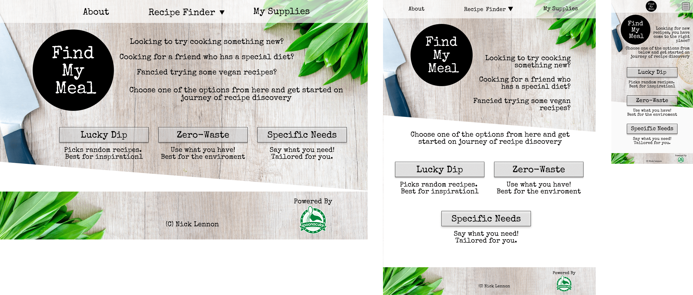
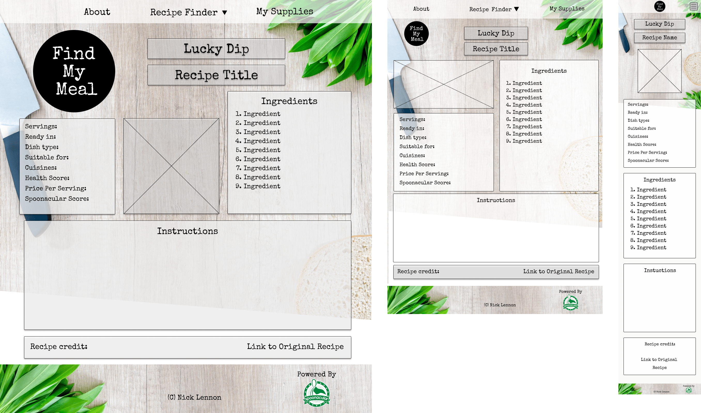
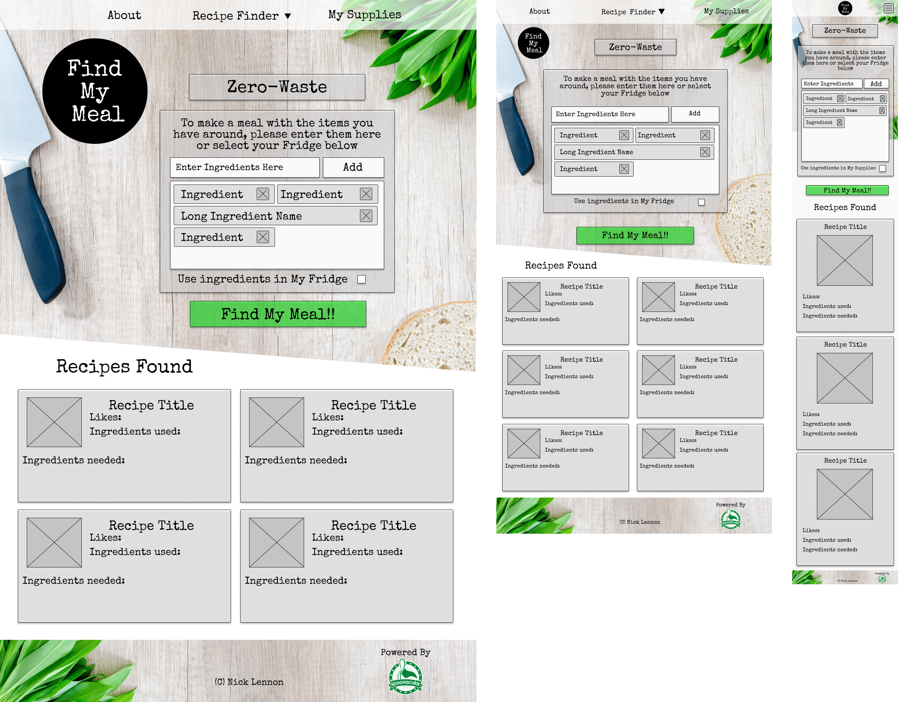
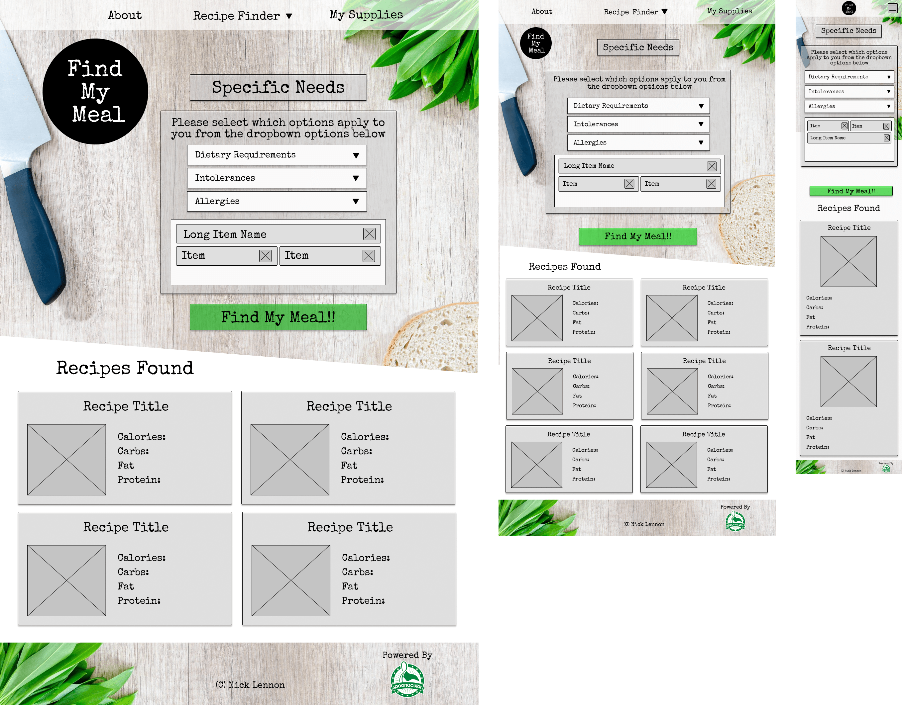
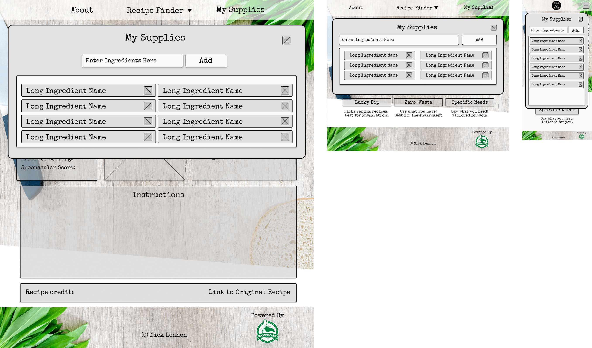

# Find My Meal

[Link to Live Project](https://nlenno1.github.io/find-my-meal-ms2/)
#
## Contents
1. [Introduction](#introduction)
3. [Development Planes](#development-planes)
    - [Strategy](#strategy)
    - [Scope](#scope)
    - [Structure](#structure)
    - [Skeleton](#skeleton)
4. [Design](#design)
5. [Features](#features)
6. [Technologies Used](#technologies-used)
7. [Search Engine Optimization (SEO)](#search-engine-optimization)
8. [Bugs and Issues](#bugs-and-issues)
9. [Testing](#testing)
    - [Device Testing](#device-testing)
    - [Peer Review Testing](#peer-review-testing)
    - [Browser Testing](#browser-testing)
    - [User Stories Testing](#user-stories-testing)
10. [Validation](#validation)
11. [Deployment](#deployment)
12. [Credits](#credits)
    - [Content](#content)
    - [Acknowledgments](#acknowledgments)

***
## Introduction
This website  is designed using APIs to enable users to find new recipes depending on their circumstances. These can either be for diet, health or enviromental reasons.

To be able to provide this I will use Spoonacular's API.

I decided to build this project as I have an interest in helping others be more enviromentally aware and helping the planet by reducing the amount of food waste that we create and cutting down on meat consumption by trying Vegan alternatives.
I also have friends and family members who either have changed their diet or have allegies/intolerances and this tool would help me cook for them.

This is the second of four Milestone Projects that make up the Full Stack Web Development Program at The Code Institute. The main requirements of this project are to create a responsive website using primarily **HTML5**, **CSS3** and **JavaScript**.

[Back to Contents](#contents)
#

## Development Planes
### Strategy

#### Project Goals
- To help **USERS** find inspiration for new recipes no matter what their preferences or allergies,
- To make it easy for **USERS** to understand, navigate and access all the information they want,
- To present the required data in an easy to read and use format,

#### User Demographic
The target demographics for this website are:
- Ages 16 - 50 years old
- All Genders and Ethnicities
- Both genders
- May have specific dietary or allergy requirements
- Interested in cooking
- Wanting to trying new things
- Open to being more enviromental

#### User Stories
Example User 1 - I am an **enthusiastic cook** looking for new recipe ideas
Example User 2 - I a newly diagnosed as **gluten intolerent** and I need to find some new recipes
Example User 3 - I am cooking for a friend who has **specific dietary needs** and I need to find a recipe
Example User 4 - I am worried about the amount of **food waste produced** and want use up my leftovers in a Meal
Example User 5 - I want to reduce my **enviromental impact** by changing my diet and adding some vegan meals to my diet  

The website needs to enable the **USER** to:
 
- Search for recipes based on:
    - Allergies/Intolerances (nut, gluten intolerances etc)
    - Diet (Vegan, Vegitarian etc)
    - What items they have to reduce their waste
- Search for random recipes to help them get inspiration for new recipes
- Discover the companies social media accounts to recieve notifications about updates, new features and deals.

The website needs to enable the **BUSNINESS** to:

- Develop a fully interactive and engaging platform that users enjoy
- Accredit use of the recipies and APIs as directed in the API documentation
- Create revenue from:
    - Selling access to premium features on the app/website,
    - Linking with supermarkets and stores to help users find the products they need to buy
- Attract new users by making the UI easy to understand and use

#### Strategy Table
I performed an Importance Viability analysis on the **USER** goals and these were the results.
| ID      | Opportunity / Problem / Feature | Importance |	Viability |
| ----------- | ----------- | ----------- | ----------- |
| A      | Allergy/Intolerances Search       | 5       | 5       |
| B   | Diet Search        | 5       | 5       |
| C    | Random Search        | 4       | 5       |
| D    | Encourage social media engagement        | 4       | 5       |

[Back to Contents](#contents)
#
### Scope 
In line with the results from the Importance Viability analysis, these are the feature that will be implimented on the first production release.
#### Features
navbar
- About - Link to a modal with instructions on how to use the service and background information
- Recipe finder - A drop down menu to the 3 recipe finders,
- My Supplies - Link to a modal containing a list of the supplies the user has,
    - In this modal the user will be able to add and remove items to use later on,

footer
- Accreditation to Spoonacular API,
- Links to social media accounts,
- Copyright information

index.html
- Logo - to give clear business identity
- Introduction - A breif description on the form of questions of the service provided and how to get started
- Recipe Finder Buttons - 3 buttons to the different recipe finders

lucky-dip.html
- Page title to confirm which service the user has selected
- Random Recipe selected displayed as in recipe.html

zero-waste.html
- Page title to confirm which service the user has selected
- Indredient selector to allow users to add ingredients that they want to search with
- "Use ingredients in My Supplies" check box option for ingredient selector
- Results cards displayed after searching containing Recipe title, the amount of likes the recipe has, the ingreients used from the ingredient selector and the ingredients that are needed to make the recipe

specific-needs.html
- Page title to confirm which service the user has selected
- Dietary Requirements, Intolerances and Allergies drop down menu selectors to allow users to select multiple items
- Results cards displayed after searching containing recipe title and nutritional information

recipe.html
- Displays recipe with:
    - Image 
    - Ingredients list
    - General information:
        - Servings
        - Preparation time
        - Dish type
        - Allergies & Intolerances suitable for
        - Cuisine
        - Health Score
        - Price Per Serving
        - Spoonacular Score
    - Instructions 
    - Credits  
        - Original recipe author
        - Link to the original recipe

My Supplies modal
- Indredient selector to allow users to add ingredients to their supplies
- Display ingredients added to view or allow user to remove

About Modal
- Instructions on how to use the service
- Background information

#### Features for future releases

- Email recipe link to yourself usign EmailJS API
- Add calender event using Google Calender API with a link to the recipe
- Links to supermarkets to display and compare live item prices 
- Automatically generated shopping lists made up of the items you are missing from "My Supplies" 

#### Functionality Requirements

- Easy navigation to the required information
- Quick loading of the website
- Quick response times from the API
- Pagenation when appropriate

[Back to Contents](#contents)
#

### Structure

The website has been designed around a **Tree** structure hierarchy. This reduces the overall complexity of the site which allows users to navigate it easier.

Below is a diagram to better illustrate this structure.

- From index.html you can select which recipe finder service you want and you can transition from one service to another.
- Once you make a search using a service the "Search Results" will display on the page that is currently viewed. If you perform another search then these results will be replaces by the new ones.
- When a Search result is selected, recipe-display.html will be called and loaded with the requested information.
- If the user tries to move horizontally on the graph after displaying "Search Results" or loading recipe-display.html then they will lose all retrieved data from the API.

[Back to Contents](#contents)

### Skeleton

Wireframes were created using Figma to aid in the design process. Some design elements have changed during the building process to improve the user experience and functionality of the site

After designing these wireframes, I decided to add a Home and Contact buttons to the NavBar as I added a new contact page, however I removed these at the Tablet break point to make the bar less cluttered. To maintain this functionality, I added a contact page link to the footer, which is easily accessible on all pages, and the logo will also act as a home button, as it does on all pages.

index.html:

lucky-dip.html:

zero-waste.html:

specific-needs.html:

recipe-display.html:

Modal Design:

[Back to Contents](#contents)

#### Design

**Colour Scheme**

The main colours used throughout the website are Black, White and Grey (#c4c4c4) using a bright Green (#1EC820) to highlight. 

These colours were chosen as they compliment the website's background image and give the site a clean, modern and professional feel without being too bright and flashy which will appeal to the demographic.

**Typography**

This project uses the font Special Elite for headings and Open Sans for body text. This allows the headings to be themed while having clear text to make it easier to read which imporves the user experience.

**Imagery**

The background image used is appropriate to the style of the website.

All recipe images are provided by the API.

[Back to Contents](#contents)

# Features

[Back to Contents](#contents)

# Technologies Used

- HTML5 - Programming Language
- CSS3 - Programming Language
- JavaScript - Programming Language
- [Spoonacular API](https://spoonacular.com/food-api) - API functionality
- [Bootstrap v4.3.1](https://getbootstrap.com/) - Library Import
- [Google Fonts](https://fonts.google.com/) - Typography Import
- [Git Pod](https://gitpod.io/) - IDE (Integrated Development Environment)
- [Git](https://git-scm.com/) - Version Control Tool
- [Github](https://github.com/) - Cloud based hosting service to manager my Git Repositories
- [Code Institute GitPod Template](https://github.com/Code-Institute-Org/gitpod-full-template) - Provides GitPod extensions to help with code production
- [Google Chrome Development Tools](https://developer.chrome.com/docs/devtools/) - Development Tools
- [Compress PNG](https://compresspng.com/) - Image Compressor
- [Tiny JPG](https://tinyjpg.com/) - JPG and PNG Image Compressor
- [Figma](https://www.figma.com/) - Wireframe designer software
- [HTML Formatter](https://www.freeformatter.com/html-formatter.html#ad-output) - Formatting HTML Code
- [CSS Beautifier](https://www.freeformatter.com/css-beautifier.html) - Beautifying CSS Code

[Back to Contents](#contents)

### Bugs and Issues

|Bug ID # | Bug      | Cause/Reason | Fix |
| ----------- | ----------- | ----------- | ----------- | 
|1 |Background mask pushing down past the footer|Mask height and askew angle too large|Reduced element height, added a second mask element and staggered the angles of the two elements to cover the required area|
|2 |Background masks on top of footer |Footer z-index was lower than the mask which was given a higher z-index to put it on top of the background |Raised the z-index of the footer to equal the background|
|3 |Background image not covered by masks on larger pages|Mask pushed lower down the page by content|Edited the background image to have an angled bottom|
|4 |Gaps inbetween the two background masks|Larger screenwidths caused the askew elements to become thinner|Increased element height and set it using a screen width measurement (vw) so it increases relative to the screen width|
|5 |Navbar Dropdown Menu moving background image|Image reacting to page height change when the dropdown was added to the page and the navbar was above the background image element on the page|Set the background image in its own div behind the navbar, set background-position to top and background-size attribute to 100% auto|
|6 |Jquery Click Event Element Undefined Errors|Moved navbar element creation to JS file so the click event was refering to an element that didn't exist yet|Added $(window).ready to the Jquery click events so they are called when the element exists| 
|7 |X axis page overflow|.nav-item elements in the navbar being too wide after adding padding and margins|I could have used the box-sizing: border-box; css attribute to negate the margin/padding but I decided to reduce the .nav-item width to compensate for the padding/margins manually|
|8 |createIngredientObject() broken|Passed "My Supplies" as the array name which cause errors when assigned as the variable name as it contained a space|Altered the array name from "My Supplies" to "MySuppliesArray"|
|9 |Current My Supplies array not empty after calling clearLocalStorage()|When writing the function, I cleared the localStorage array but not the array assigned to the variable mySuppliesArray|I added the assigner mySuppliesArray = [] to empty the array|
|10 |My Supplies load createIngredientObject() returning error|When adding to createIngredientObject() I rearranged the required arguement order which I did not change in the My Supplies load function and when taking the item names from the localStorage array, they contained hyphens which I did not want displayed|Double checked what the required arguements were and rearraged them to match the edited function before creating removeHyphens() to turn the saved item name into a screenName to display|
|11 |createViewRecipeButtons() returning error|Function was called before the element for click event was created|Added function to displaySearchResults() after element creation|
|12 |Recipe-display-button click event no sending the correct data to the API call therefore not getting a response|Typographical error lead to an extra " in each button element when being created by displaySearchResults()|Removed the extre character|
|13 |Specific-needs API call returning undefined results when called with displaySearchResults()|The data structure returned by the API is different for each search type therefore the function was trying to acces data that wasn't there|Using dot notation, I referanced the first item in the response array|
|14 |Modal resizing on page y-axis overflow|Accordian section expanding past the height of the page added the scroll bar to the page which resized the modal|I added overflow: auto; to the modal so the scroll bar would be inside the modal rather than on the edge of the entire page|
|15 |checkIfHasValue function missing undefined values|I used the string "undefined" as a operand for the conditional statement in the function when it should have been the value of undefined|Removed the "" to make the aperand value undefined|
|16 |404 Page not found error for recipe-display.html |Using an absolute url path in createBackToResultsButton() |Changed path to a relative url path |
|17 Footer not at the bottom of the page on larger devices |Page content not big enought to push footer to the bottom of the screen |Set the min-height attribute of .main-body, using calc() vh and the height of the footer, to keep the footer at the bottom of the page  |
|18| JS Validator Error - "Expected an assignment or function call and instead saw an expression" | Used a ternary expression to call functions depending on a variable value | Restructured the ternary expression into a traditional if/else conditional statement |

### Testing
#### Device Testing
#### Peer Review Testing
#### Browser Testing
#### User Stories Testing

# Validation

To view all Validation Result Files [Click here](assets/readme-assets/validation-files.md){:target="_blank"}.

To validate my project, I used the following validators:
- HTML - [W3C Validator Service](https://validator.w3.org/)
- CSS - [CSS Validator Service](http://jigsaw.w3.org/css-validator/)
- Java Script - [Beautify Tools JS Validator](https://beautifytools.com/javascript-validator.php)
- Color Tester - [A11y](https://color.a11y.com/)
- Mobile Compatability Tester - [Google Mobile-Friendly Test ](https://search.google.com/test/mobile-friendly)
- General Performance - [Google Lighthouse](https://developers.google.com/web/tools/lighthouse)

### Results and Outcomes of Validation

The only issues raised by the validators after final testing are:

#### HTML

| Error | Reason |
| -------- | -------- |
|Section lack heading | This only occurs where there is an image which acts as the header |
|Empty heading | This heading is acting as a placeholder to have data loaded into it and doesn't need to be seen until the information is loaded |

#### JS

| Error | Reason |
| -------- | -------- |
|*Function Name* is not defined | When this error occurs, it is because the function has been defined in a different js file as it is used in multiple pages |
|'sendMail' is defined but never used | This is a function that is called by a form submit click event and therefore doe not need to be called in the JS file |
|Functions declared with in loops referancing an outer scoped variable may lead to confusing semantics | This is just a warning however in this case the semantic are simple so it is not confusing |

### Deployment

### Credits
#### Content
#### Acknowledgments