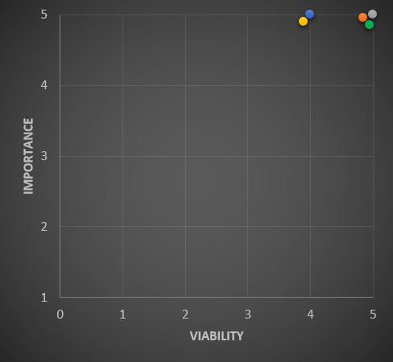
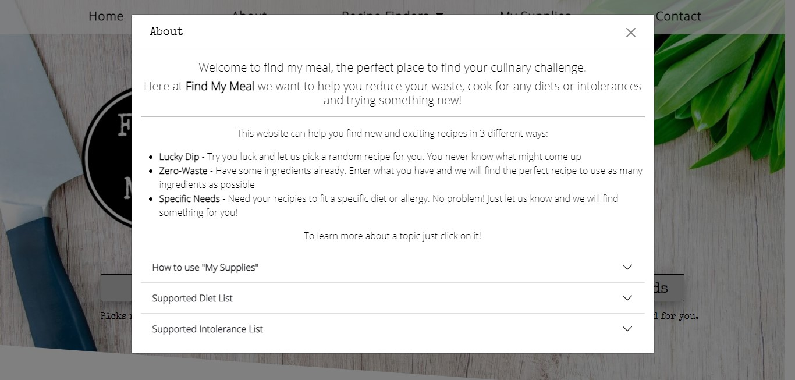

# Find My Meal

[Link to Live Project](https://nlenno1.github.io/find-my-meal-ms2/)

***
# Introduction
This website  is designed using APIs to enable users to find new recipes depending on their circumstances. These can either be for diet, health or environmental reasons.

To be able to provide this I will use Spoonacular's API.

I decided to build this project as I have an interest in helping others be more environmentally aware and helping the planet by reducing the amount of food waste that we create and cutting down on meat consumption by trying Vegan alternatives.
I also have friends and family members who either have changed their diet or have allergies/intolerances and this tool would help me cook for them.

This is the second of four Milestone Projects that make up the Full Stack Web Development Program at The Code Institute. The main requirements of this project are to create a responsive website using primarily **HTML5**, **CSS3** and **JavaScript**.

[Back to Top](#find-my-meal)
#

# UI & UI Development Planes
## Strategy

### Project Goals
- To help **USERS** find inspiration for new recipes no matter what their preferences, allergies or ingredients,
- To make it easy for **USERS** to understand, navigate and access all the information they want,
- To present the required data in an easy to read and use format and handle any errors in a way to help the **USER** understand the problem,
-  Design, develop and implement a dynamic front-end web application using HTML5, CSS3 and JavaScript,

### User Demographic
The target demographics for this website are:
- Ages 16 - 50 years old
- All Genders and Ethnicities
- Both genders
- May have specific dietary or allergy requirements
- Interested in cooking
- Wanting to try new things
- Open to being more environmental

### User Stories

- Example User 1 - I am an **enthusiastic cook** looking for new recipe ideas
- Example User 2 - I a newly diagnosed as **gluten intolerant** and I need to find some new recipes
- Example User 3 - I am cooking for a friend who has **specific dietary needs** and I need to find a recipe
- Example User 4 - I am worried about the amount of **food waste produced** and want use up my leftovers from previous meals
- Example User 5 - I want to reduce my **enviromental impact** by changing my diet and adding some vegan meals to my meal routine

The website needs to enable the **USER** to:
 
- Search for recipes based on:
    - Allergies/Intolerances (nut allergies, gluten intolerances etc)
    - Diet (Vegan, Vegetarian etc)
    - What items they have to reduce their waste
- Search for random recipes to help inspire them
- Get in touch with suggestions to improve the service or to report bugs

The website needs to enable the **BUSINESS** to:

- Develop a fully interactive and engaging platform that users enjoy
- Accredit use of the recipes and APIs as directed in the API documentation
- Potentially revenue from:
    - Selling access to premium features on the app/website,
    - Linking with supermarkets and stores to help users find the products they need to buy
    - Advertising specific stores or products targeted at users depending on what ingredients or searches they use
- Attract new users by making the UI easy to understand and use

### Strategy Table
I performed an Importance Viability analysis on the **USER** goals and these were the results.
| ID      | Opportunity / Problem / Feature | Importance |	Viability |
| ----------- | ----------- | ----------- | ----------- |
| A      | Allergy/Intolerances Search       | 5       | 5       |
| B   | Diet Search        | 5       | 5       |
| C    | Zero Waste Search        | 5      | 5       |
| D | Random Search        | 4       | 5       |
| E | Encouraging user to contact developer | 4  | 5  |

As you can see all the stated features have a high Importance and Viability score so will be included in the project.

[Back to Top](#find-my-meal)
#
## Scope 
In line with the results from the Importance Viability analysis, all the previously mentioned features will be implemented on the first production release.

### Functionality Requirements

- Clean and themed presentation of information
- Easy navigation to the required information
- Quick loading of the website
- Quick response times from the API
- Contact the developer for and feedback or bug reports

[Back to Top](#find-my-meal)
#

## Structure

The website has been designed around a **Tree** structured hierarchy. This reduces the overall complexity of the site which allows users to navigate it easier.

Below is a diagram to better illustrate this structure.

- From index.html you can select which recipe finder service you want and you can transition from one service to another.
- Once the user makes a search using a service the "Search Results" will display on the page that is currently viewed. If the user performs another search then these results will be replaced by the new ones.
- When a Search result is selected, recipe-display.html will be called and loaded with the requested information.
- If the user tries to move horizontally on the hierarchy tree after displaying "Search Results" or loading recipe-display.html then they will lose all retrieved data from the API.

[Back to Top](#find-my-meal)

## Skeleton

Wireframes were created using [Figma](https://www.figma.com/) to aid in the design process. Some design elements have changed during the building process to improve the user experience and functionality of the site

After designing these wireframes, I decided to add a Home and Contact buttons to the NavBar as I added a new contact page, however I removed these at the Tablet break point to make the bar less cluttered. To maintain this functionality, I added a contact page link to the footer, which is easily accessible on all pages, and the logo will also act as a home button, as it does on all pages.

index.html:

lucky-dip.html:

zero-waste.html:

specific-needs.html:

recipe-display.html:

Modal Design:

[Back to Top](#find-my-meal)

### Design

**Colour Scheme**

The main colours used throughout the website are Black (#000), White (#fff), Off White (#fafafa) and Grey/Silver (#c4c4c4) using a bright Green (#1EC820) to highlight. 

These colours were chosen as they compliment the website's background image and give the site a clean, modern and professional feel without being too bright and flashy which will appeal to the demographic.

**Typography**

This project uses the font [Special Elite](https://fonts.google.com/specimen/Special+Elite?query=special+el) for headings and [Open Sans](https://fonts.google.com/specimen/Open+Sans?query=open+sans) for body text. This allows the headings to be themed while having clear text to make it easier to read which improves the user experience.

**Imagery**

The [background image](assets/images/choppingboard-background.jpg) used is appropriate to the style of the website.

All recipe images are supplied and formatted by the [API](https://spoonacular.com/food-api).

[Back to Top](#find-my-meal)

# Features
navbar
- Logo - to give clear business identity and act as a link to index.html
- Home Button - link to index.html (not visible at tablet breakpoint)
- About Button - Link to a modal with instructions on how to use the service and background information
- Recipe finder Button - A drop down menu to the 3 recipe finders
- My Supplies Button - Link to a modal containing a list of the supplies the user has
    - In this modal the user will be able to add and remove items to use later on
- Contact Button - link to contact.html which allows users to contact the developer (not visible at tablet breakpoint)

footer
- Accreditation to Spoonacular API as layed out in the usage terms and conditions,
- Links to contact page (contact.html) to help users get in touch at all breakpoints,
- Copyright information,

index.html
- Introduction - A brief description of the service provided by the website and how to get started
- Recipe Finder Buttons - 3 buttons which link to the different recipe search options which animate on hover 

lucky-dip.html
- Page title to confirm which service the user has selected
- Random Recipe selected displayed as in recipe.html (see below)

zero-waste.html
- Page title to confirm which service the user has selected
- Ingredient selector to allow users to add ingredients that they want to search with
    - Ingredient input box allows user to input a custom ingredient name
    - Add button to create ingredient element with remove item button
    - Remove button on ingredient allows user to remove the item from the screen and the selected list
    - Ingredients display to allow users to see ingredients already added
- "Use ingredients in My Supplies" check box option for ingredient selector which uses previously added ingredients to the "My Supplies" array combined with the extra added ingredients in the recipe search
- Results title to confirm that results have been found or if an error has occurred during the API call and display process
- User feedback is provided if the search button is clicked and either both lists are empty, the custom list is empty and "Use ingredients in My Supplies" is not selected or "Use ingredients in My Supplies" check box is selected but the list is empty.
- Results cards displayed after searching containing;
    - Recipe title
    - Amount of likes the recipe has
    - Ingredients used from the ingredient selector
    - Ingredients that are needed to make the recipe
    - "View Recipe" button to take the user to the full details of that recipe

specific-needs.html
- Page title to confirm which service the user has selected
- Dietary Requirement/Intolerances Selector to allow users to select supported Diets or Intolerances to use in their recipe search;
    - Dietary Requirements, Intolerances and Allergies drop down menu selectors to allow users to select a supported item
    - Add button to create item element with remove item button
    - Remove button on the item allows user to remove the item from the screen and the selected list
    - Item display to allow users to see items already added
- User feedback is provided if the search button is clicked and both lists are empty
- Results title to confirm that results have been found or if an error has occurred during the API call and display process
- Results cards displayed after searching containing;
    - Recipe title
    - Dish type
    - Preparation time
    - Servings
    - Health score (out of 100)
    - Compatible Diets
    - "View Recipe" button to take the user to the full details of that recipe

recipe.html
- Displays recipe with:
    - Recipe Image 
    - A general description of the recipe which has all links and formatting removed from it 
    - A numbered Ingredients list
    - General information (displayed with bullet points) containing:
        - Servings
        - Preparation time
        - Dish type
        - Allergies & Intolerances suitable for
        - Cuisine
        - Health Score
        - Price Per Serving
        - Spoonacular Score
    - Numbered Instructions 
    - Credits  
        - Original recipe author
        - Link to the original recipe to allow the user to find further information on the recipe if it is needed

My Supplies modal
- Ingredient selector to allow users to add ingredients to their supplies containing;
    - Ingredient  input box allows user to input a custom ingredient name
    - Add button to create ingredient element with remove item button
    - Remove button on ingredient allows user to remove the item from the screen and the selected list
    - Ingredients display to allow users to see ingredients already added
- "Clear My Supplies" Button to remove all ingredients from the display, session storage and local storage
- Close buttons to close modal

About Modal
- A brief introduction and instructions on how to use this service
- Accordion section to allow users to find more information quickly about specific topics (when Accordion expands past the bottom of the screen, scroll bar is added to modal for better UX)
- Close buttons to close modal

## Features for future releases

- Email recipe link to the user using EmailJS API
- Add calendar event using Google Calender API with a link to the recipe to arrange to use that recipe on a specific date and time
- Links to supermarkets to display and compare live ingredients prices and assist in the online purchasing of the ingredients
- Automatically generated shopping lists made up of the items you are missing from "My Supplies" 
- Arrange results by different qualifiers (eg. name, ingredients needed etc)
- Change the amount of results presented after search
- Add custom pagination for the search results

# Bugs and Issues

|Bug ID # | Bug      | Cause/Reason | Fix |
| ----------- | ----------- | ----------- | ----------- | 
|1 |Background mask pushing down past the footer|Mask height and askew angle too large|Reduced element height, added a second mask element and staggered the angles of the two elements to cover the required area|
|2 |Background masks on top of footer |Footer z-index was lower than the mask which was given a higher z-index to put it on top of the background |Raised the z-index of the footer to equal the background|
|3 |Background image not covered by masks on larger pages|Mask pushed lower down the page by content|Edited the background image to have an angled bottom|
|4 |Gaps in between the two background masks|Larger screen widths caused the askew elements to become thinner|Increased element height and set it using a screen width measurement (vw) so it increases relative to the screen width|
|5 |Navbar Dropdown Menu moving background image|Image reacting to page height change when the dropdown was added to the page and the navbar was above the background image element on the page|Set the background image in its own div behind the navbar, set background-position to top and background-size attribute to 100% auto|
|6 |Jquery Click Event Element Undefined Errors|Moved navbar element creation to JS file so the click event was refering to an element that didn't exist yet|Added $(window).ready to the Jquery click events so they are called when the element exists| 
|7 |X axis page overflow|.nav-item elements in the navbar being too wide after adding padding and margins|I could have used the box-sizing: border-box; css attribute to negate the margin/padding but I decided to reduce the .nav-item width to compensate for the padding/margins manually|
|8 |createIngredientObject() broken|Passed "My Supplies" as the array name which cause errors when assigned as the variable name as it contained a space|Altered the array name from "My Supplies" to "MySuppliesArray"|
|9 |Current My Supplies array not empty after calling clearLocalStorage()|When writing the function, I cleared the local storage array but not the session storage mySuppliesArray|I added the assigner mySuppliesArray = [] to empty the session array|
|10 |My Supplies load createIngredientObject() returning error|When adding to createIngredientObject() I rearranged the required argument order which I did not change in the "My Supplies" load function and when taking the item names from the localStorage array, they contained hyphens which I did not want displayed|Double checked what the required arguments were and rearraged them to match the edited function before creating removeHyphens() to turn the saved item name into a screenName to display|
|11 |createViewRecipeButtons() returning error|Function was called before the element for click event was created|Added function to displaySearchResults() after element creation|
|12 |Recipe-display-button click event no sending the correct data to the API call therefore not getting a response|Typographical error lead to an extra " in each button element when being created by displaySearchResults()|Removed the extra character|
|13 |Specific-needs API call returning "searchResults[0] is undefined" error when called with displaySearchResults()|The data structure returned by the API is different for each search type therefore the function was trying to access data that wasn't there|Using dot notation, I referenced the first item in the response array|
|14 |Modal resizing on page y-axis overflow|Accordion section expanding past the height of the page added the scroll bar to the page which resized the modal|I added overflow: auto; to the modal so the scroll bar would be inside the modal rather than on the edge of the entire page|
|15 |checkIfHasValue function missing undefined values|I used the string "undefined" as a operand for the conditional statement in the function when it should have been the value of undefined|Removed the "" to make the operand value undefined|
|16 |404 Page not found error for recipe-display.html |Using an absolute url path in createBackToResultsButton() |Changed path to a relative url path |
|17 |Footer not at the bottom of the page on larger devices |Page content not big enough to push footer to the bottom of the screen |Set the min-height attribute of .main-body, using calc() vh and the height of the footer, to keep the footer at the bottom of the page  |
|18 | JS Validator Error - "Expected an assignment or function call and instead saw an expression" | Used a ternary expression to call functions depending on a variable value | Restructured the ternary expression into a traditional if/else conditional statement |
|19 | Footer being pushed down past the bottom of the screen when viewed on a tablet | Page was using viewport height (vh) to set a minimum height value when there was a lack of content to push the footer past the bottom of the screen however, the vh does not include the browser interface on mobile devices so was pushing the footer down too far | Added footer-position.js to set the footer to the bottom of the window when there isn't enough content but doesn't keep it at the bottom when there is content to push it past the bottom of the window |

[Back to Top](#find-my-meal)

# Technologies Used

- HTML5 - Programming Language
- CSS3 - Programming Language
- JavaScript - Programming Language
- [jQuery](https://jquery.com/) - JavaScript Library
- [Spoonacular API](https://spoonacular.com/food-api) - API functionality
- [Bootstrap v4.3.1](https://getbootstrap.com/) - Library Import
- [Google Fonts](https://fonts.google.com/) - Typography Import
- [Git Pod](https://gitpod.io/) - IDE (Integrated Development Environment)
- [Git](https://git-scm.com/) - Version Control Tool
- [Github](https://github.com/) - Cloud based hosting service to manager my Git Repositories
- [Code Institute GitPod Template](https://github.com/Code-Institute-Org/gitpod-full-template) - Provides GitPod extensions to help with code production
- [Google Chrome Development Tools](https://developer.chrome.com/docs/devtools/) - Development Tools
- [Compress PNG](https://compresspng.com/) - Image Compressor
- [Tiny JPG](https://tinyjpg.com/) - JPG and PNG Image Compressor
- [Figma](https://www.figma.com/) - Wireframe designer software
- [HTML Formatter](https://www.freeformatter.com/html-formatter.html#ad-output) - Formatting HTML Code
- [CSS Beautifier](https://www.freeformatter.com/css-beautifier.html) - Beautifying CSS Code
- [JavaScript Validator](https://beautifytools.com/javascript-validator.php) - Validating JS code
- [GIMP](https://www.gimp.org/) - Image editor
- [Coolors](https://coolors.co/) - Colour scheme generator
- [Font Awesome](https://fontawesome.com/) - Icon provider

[Back to Top](#find-my-meal)

# Testing

Throughout the building of this project, I tested the responsive design and functionality using [Google Chrome Developer Tools](https://developer.chrome.com/docs/devtools/). The console and elements feature helped me debug any issues and the adaptable display helped visualize each page at different screen widths.

This is the functionality check list that I used when testing my project.

|Element/Section |Feature to Test |
| -------- | -------- |
|**Navbar** *(on all pages)*  |.nav-link has a hover effect are directing to the intended pages |
| |Modals open and close correctly and display relevant content  |
| |Dropdown menu work with hover effects |
| |Element stays at the top of the page |
| |Logo link directs to index.html |
|**Footer** *(on all pages)* |Contact the developer link has hover effect and directs to the contact page |
| |Spoonacular image link opens correct page  in a new tab |
|**My Supplies Modal** |Input field functions as expected (including handling invalid characters and formatting input to remove excessive spaces) |
| |Appropriate user feedback if impossible data values are entered |
| |Add button functions as expected |
| |On loading, any null or undefined values in local storage are handled |
| |Created elements are formatted correctly and can be removed via the close/delete button |
| |"Clear My Supplies" button removes all created elements while also removing the item names from session and local storage |
|**About Modal** |All information displays correctly |
| |Accordion section functions as expected |
|**index.html**  |Recipe-selector-buttons have the correct href and has the enlarging hover effect  |
|**contact.html**  |All input fields work as expected, validate the data that is entered and are required before submitting  |
| |User feedback provides suitable information/responses during and after sending any message, including if there was an error  |
| |The emailJS API call responds as expected |
|**lucky-dip.html** & **zero-waste.html**|Input/select fields function as expected (including handling invalid characters and formatting input to remove excessive spaces)|
| |Appropriate user feedback if impossible data values are entered |
| |Add button functions as expected and elements are created correctly |
| |"Use My Supplies" check box with click input functions as expected *(zero-waste.html only)* |
| |"Find My Meal" button click event functions as expected and makes the correct API call |
| |User feedback provides suitable information/responses during and after API call, including if there is an error   |
| |API call responds as expected |
| |Data from API is presented appropriately and zero or impossible values are managed efficiently  |
| |View recipe button functions as expected and passed on the correct data to local storage |
| | On loading, pages display the correct information when expected|
|**recipe-display.html** |API call responds as expected |
| |Data from API is presented appropriately and zero or impossible values are managed efficiently   |
| |Back to results button functions as expected and directs to the correct page  |

## Device Testing

### Mobile
To test the website at the **Mobile breakpoint**, I focused on using the **Iphone 5/SE (320px)** for the **smaller phones** and the **Iphone 6/7/8 Plus (414px)** for the **larger phones**.
All other mobile breakpoints fit into this range of screen sizes, apart from the Galaxy Fold, therefore felt it was a good range to work with.
As this project was designed using the mobile first principle, there were very few bugs as the were removed as the site was built.

I used my own **Samsung Galaxy S10 (360px)** for the mobile device real world testing, as this is roughly the median of the range I tested on Google Chrome Developer Tools, to check that all elements were as expected.

### Tablet

To test the project on a tablet, I used the **Ipad (768px)** breakpoint on Google Chrome Developer Tools as it is a very generic size and has the tablet shroud on it to help with scaling the elements.
Throughout this testing, I discovered some spacing issues which were corrected with **Media Queries** at the specific breakpoints.

I used my **Samsung Galaxy Tab 4 (800px)** for physical user testing.

### Desktop

During development, I tested the Desktop breakpoint by either using my **default screen size (1024px)** or the 1440px breakpoint in Google Chrome Dev Tools. This was to enable users who have bigger screens than myself to still have the best UI and UX possible.
There were some spacing issues at the larger screen size so again I used **Media Queries** at **min-width:1200px**to solve these issues.

For real world testing, I used an external 1440px monitor to make sure the display was as expected and used some peer review testing for ultra wide monitors (1980 px).

## Peer Review Testing

I asked a selection of my peers (family, collegues and friends) using resources like **Slack** to access, test and review my project at several different points in the developement of the project.
All comments were good however I did implement a few changes from this feedback.

|Feedback |Action to improve| Feedback/Contributor|
| -------- | -------- | -------- |
|Intolerances incorrectly spelt |Spell check implemented on all visible text |Lola (Slack) |
|404 error when trying to view the full recipes |Corrected href referencing error (see **16** in [Bugs](#bugs) for more details) |Nat Kate and Daniel Steyn |
|searchResults[0] is undefined |Modified the conditional statement (see **13** in [Bugs](#bugs) for more details) |Sean Young |

## Browser Testing

Using [Lambda Test](https://www.lambdatest.com/), a cloud based browser platform, I tested the project on the latest version of the following browsers;
- Chrome
- Firefox 
- Edge 
- Safari
- Opera 

All the tests rendered similar to expected UI results and no compatibility bugs.

## User Stories Testing
As an **enthusiastic cook** looking for new recipe ideas;
- I can use either of the 3 options on index.html, or on the navbar, to find some new recipes, either randomly selected, using specific ingredients I have or depending on selected supported dietary requirements or allergies.

- If I am confused by what is supported or what I need to do to use the service, the About button is always there on the Navbar to help.

- If I want to save the ingredients I regularly have to cook with then I can add them to "My Supplies".

As a newly diagnosed **gluten intolerant**;
- I can use the Specific Needs recipe selector and choose gluten from the drop down menus to see recipes without gluten.

- If I am confused by what is supported or what I need to do to use the service, the About button is always there on the Navbar to help with details of what intolerances are supported by the service

As someone cooking for a friend who has **specific dietary needs**;
- I can use the  Specific Needs recipe selector and enter the specific dietary requirements they have.

- If I need help using the service or finding out what the options mean, there is a full description in the About modal, the link to which is in the Navbar at all times.

- If their specific dietary requirement is missing then the contact page can be accessed through the footer or navbar to allow the user to get in touch and suggest an item to add to the service.

As an environmentalist, worried about the amount of **food waste produced**;
- I can use the Zero Waste recipe selector and enter the specific ingredients that I have to use the last of.

- If I regularly have the same items to use then I can put them in My Supplies to use in later searches

As a enviromentalist wanting to **reduce my enviromental impact** by changing my diet and adding some vegan meals to my meal routine;
- I can use the Specific Needs recipe selector and choose vegan from the Diet drop down menu to see some vegan recipes.

- If I am confused by what the different diets mean, the About button is always there on the Navbar to help with more details

[Back to Top](#find-my-meal)

# Validation

To view all Validation Result Files [Click here](assets/readme-assets/validation-files.md)

To validate my project, I used the following validators:
- HTML - [W3C Validator Service](https://validator.w3.org/)
- CSS - [CSS Validator Service](http://jigsaw.w3.org/css-validator/)
- Java Script - [Beautify Tools JS Validator](https://beautifytools.com/javascript-validator.php)
- Color Tester - [A11y](https://color.a11y.com/)
- Mobile Compatibility Tester - [Google Mobile-Friendly Test ](https://search.google.com/test/mobile-friendly)
- General Performance - [Google Lighthouse](https://developers.google.com/web/tools/lighthouse)

## Results and Outcomes of Validation

The only issues raised by the validators after final testing are:

### HTML

| Error | Reason |
| -------- | -------- |
|Section lack heading | This only occurs where there is an image which acts as the header |
|Empty heading | This heading is acting as a placeholder to have data loaded into it and doesn't need to be seen until the information is loaded |

### JS

| Error | Reason |
| -------- | -------- |
|*Function Name* is not defined | When this error occurs, it is because the function has been defined in a different js file as it is used in multiple pages |
|'sendMail' is defined but never used | This is a function that is called by a form submit click event and therefore doe not need to be called in the JS file |
|Functions declared with in loops referencing an outer scoped variable may lead to confusing semantics | This is just a warning however in this case the semantic are simple so it is not confusing |

[Back to Top](#find-my-meal)

# Deployment

All my code was written using [Gitpod](https://www.gitpod.io/), an online IDE, and then pushed to a repository which was stored on my [Gitpod account](https://github.com/nlenno1/).

This project is deployed on GitHub Pages. 
This is the process I used to deploy my project:

1. In my Github Repository I selected the settings tab and scrolled down to the GitHub Pages section.
2. In the source section, for the branch drop down menu, I selected "Master" and then clicked the save button.
3. Once this process had been completed the website URL was displayed above the GitHub Pages section.

This code can be cloned or forked from the [GitHub repository](https://github.com/nlenno1/find-my-meal-ms2).

## Forking the Repository
When you fork the repository you create a copy of the original repository on your own GitHub account to view and edit without effect the original.
To Fork something you need to:

1. Log into your GitHub account or create one.
2. Open the [repository](https://github.com/nlenno1/find-my-meal-ms2).
3. Click the "Fork" button which is located on the right-hand side of the screen just below your user icon.
4. The fork should load and save to your GitHub account.

## Cloning the Repository using GitPod
To clone the repository, you first need to:

1. Install the GitPod Browser Extension for Chrome (including restarting the browser).
2. Log into your GitHub or create an account.
3. Find the GitHub Repository that you want to clone.
4. Click the green "GitPod" button in the top right corner of the repository. This will trigger a new GitPod workspace to be created.

## Cloning the Repository using Git

1. Open the [repository](https://github.com/nlenno1/find-my-meal-ms2), click the  code button, which is located on the right above all the repository file names.
2. Select HTTPS and copy the clone URL.
3. In your command line type "git clone" and then paste the URL that you just copied.
4. Press enter to create your local clone

[Back to Top](#find-my-meal)

# Credits

Code snippets
NavBar, Modal and Accordion template taken from [Bootstrap Documentation](https://getbootstrap.com/docs/5.0/components/navbar/) and heavily modified and customized.

Resources
- [Code Institute Course Content](https://courses.codeinstitute.net/) - Code fundamental learning platform
- Code Institute Slack Community and Tutor network
- [W3 Schools](https://www.w3schools.com/) - Learning resource
- [CSS-Tricks](https://css-tricks.com/) - Learning and bug fixing resource
- [Stack Overflow](https://stackoverflow.com/) - Bug fixing research

## Content

All text content is original to this site unless provided by [Spoonacular API](https://spoonacular.com/food-api) and displayed with expected accreditation 

## Media 

Recipe images are provided by [Spoonacular API](https://spoonacular.com/food-api)

Loader Gif sourced from [AJAX Load](http://www.ajaxload.info/)

[Background image](https://pixabay.com/photos/wood-table-breakfast-lunch-dinner-2142217/) downloaded from Pixabay, and heavily edited using [GIMP](https://www.gimp.org/)

## Acknowledgments

README template used to produce this documentation is from [Code Institute README Template](https://github.com/Code-Institute-Solutions/readme-template)

A big thank you to my **CI mentor** and the **CI Slack Community** who have offered support and encouragement throughout the building of this project.

[Back to Top](#find-my-meal)
