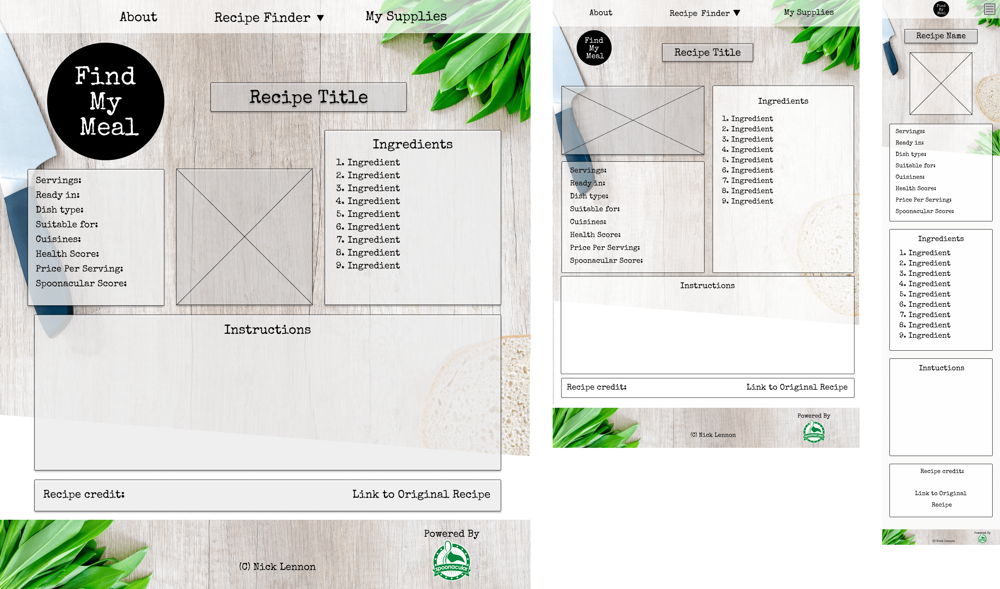

# Find My Meal

[Link to Live Project](https://nlenno1.github.io/find-my-meal-ms2/)
#
## Contents
1. [Introduction](#introduction)
3. [Development Planes](#development-planes)
    - [Strategy](#strategy)
    - [Scope](#scope)
    - [Structure](#structure)
    - [Skeleton](#skeleton)
4. [Design](#design)
5. [Features](#features)
6. [Technologies Used](#technologies-used)
7. [Search Engine Optimization (SEO)](#search-engine-optimization)
8. [Bugs and Issues](#bugs-and-issues)
9. [Testing](#testing)
    - [Device Testing](#device-testing)
    - [Peer Review Testing](#peer-review-testing)
    - [Browser Testing](#browser-testing)
    - [User Stories Testing](#user-stories-testing)
10. [Validation](#validation)
11. [Deployment](#deployment)
12. [Credits](#credits)
    - [Content](#content)
    - [Acknowledgments](#acknowledgments)

***
## Introduction
This website  is designed using APIs to enable users to find new recipes depending on their circumstances. These can either be for diet, health or enviromental reasons.

To be able to provide this I will use Spoonacular's API.

I decided to build this project as I have an interest in helping others be more enviromentally aware and helping the planet by reducing the amount of food waste that we create and cutting down on meat consumption by trying Vegan alternatives.
I also have friends and family members who either have changed their diet or have allegies/intolerances and this tool would help me cook for them.

This is the second of four Milestone Projects that make up the Full Stack Web Development Program at The Code Institute. The main requirements of this project are to create a responsive website using primarily **HTML5**, **CSS3** and **JavaScript**.

[Back to Contents](#contents)
#

## Development Planes
### Strategy

#### Project Goals
- To help **USERS** find inspiration for new recipes no matter what their preferences or allergies,
- To make it easy for **USERS** to understand, navigate and access all the information they want,
- To present the required data in an easy to read and use format,

#### User Demographic
The target demographics for this website are:
- Ages 16 - 50 years old
- All Genders and Ethnicities
- Both genders
- May have specific dietary or allergy requirements
- Interested in cooking
- Wanting to trying new things
- Open to being more enviromental

#### User Stories
Example User 1 - I am an **enthusiastic cook** looking for new recipe ideas
Example User 2 - I a newly diagnosed as **gluten intolerent** and I need to find some new recipes
Example User 3 - I am cooking for a friend who has **specific dietary needs** and I need to find a recipe
Example User 4 - I am worried about the amount of **food waste produced** and want use up my leftovers in a Meal
Example User 5 - I want to reduce my **enviromental impact** by changing my diet and adding some vegan meals to my diet  

The website needs to enable the **USER** to:
 
- Search for recipes based on:
    - Allergies/Intolerances (nut, gluten intolerances etc)
    - Diet (Vegan, Vegitarian etc)
    - What items they have to reduce their waste
- Search for random recipes to help them get inspiration for new recipes
- Discover the companies social media accounts to recieve notifications about updates, new features and deals.

The website needs to enable the **BUSNINESS** to:

- Develop a fully interactive and engaging platform that users enjoy
- Accredit use of the recipies and APIs as directed in the API documentation
- Create revenue from:
    - Selling access to premium features on the app/website,
    - Linking with supermarkets and stores to help users find the products they need to buy
- Attract new users by making the UI easy to understand and use

#### Strategy Table
I performed an Importance Viability analysis on the **USER** goals and these were the results.
| ID      | Opportunity / Problem / Feature | Importance |	Viability |
| ----------- | ----------- | ----------- | ----------- |
| A      | Allergy/Intolerances Search       | 5       | 5       |
| B   | Diet Search        | 5       | 5       |
| C    | Random Search        | 4       | 5       |
| D    | Encourage social media engagement        | 4       | 5       |

[Back to Contents](#contents)
#
### Scope 
In line with the results from the Importance Viability analysis, these are the feature that will be implimented on the first production release.
#### Features
navbar
- About - Link to a modal with instructions on how to use the service and background information
- Recipe finder - A drop down menu to the 3 recipe finders,
- My Supplies - Link to a modal containing a list of the supplies the user has,
    - In this modal the user will be able to add and remove items to use later on,

footer
- Accreditation to Spoonacular API,
- Links to social media accounts,
- Copyright information

index.html
- Logo - to give clear business identity
- Introduction - A breif description on the form of questions of the service provided and how to get started
- Recipe Finder Buttons - 3 buttons to the different recipe finders

lucky-dip.html
- Page title to confirm which service the user has selected
- Random Recipe selected displayed as in recipe.html

zero-waste.html
- Page title to confirm which service the user has selected
- Indredient selector to allow users to add ingredients that they want to search with
- "Use ingredients in My Supplies" check box option for ingredient selector
- Results cards displayed after searching containing Recipe title, the amount of likes the recipe has, the ingreients used from the ingredient selector and the ingredients that are needed to make the recipe

specific-needs.html
- Page title to confirm which service the user has selected
- Dietary Requirements, Intolerances and Allergies drop down menu selectors to allow users to select multiple items
- Results cards displayed after searching containing recipe title and nutritional information

recipe.html
- Displays recipe with:
    - Image 
    - Ingredients list
    - General information:
        - Servings
        - Preparation time
        - Dish type
        - Allergies & Intolerances suitable for
        - Cuisine
        - Health Score
        - Price Per Serving
        - Spoonacular Score
    - Instructions 
    - Credits  
        - Original recipe author
        - Link to the original recipe

My Supplies modal
- Indredient selector to allow users to add ingredients to their supplies
- Display ingredients added to view or allow user to remove

About Modal
- Instructions on how to use the service
- Background information

#### Features for future releases

- Email recipe link to yourself usign EmailJS API
- Add calender event using Google Calender API with a link to the recipe
- Links to supermarkets to display and compare live item prices 
- Automatically generated shopping lists made up of the items you are missing from "My Supplies" 

#### Functionality Requirements

- Easy navigation to the required information
- Quick loading of the website
- Quick response times from the API
- Pagenation when appropriate

[Back to Contents](#contents)
#

### Structure

The website has been designed around a **Tree** structure hierarchy. This reduces the overall complexity of the site which allows users to navigate it easier.

Below is a diagram to better illustrate this structure.

- From index.html you can select which recipe finder service you want and you can transition from one service to another.
- Once you make a search using a service the "Search Results" will display on the page that is currently viewed. If you perform another search then these results will be replaces by the new ones.
- When a Search result is selected, recipe-display.html will be called and loaded with the requested information.
- If the user tries to move horizontally on the graph after displaying "Search Results" or loading recipe-display.html then they will lose all retrieved data from the API.

[Back to Contents](#contents)

### Skeleton

Wireframes were created using Figma to aid in the design process. Some design elements have changed during the building process to improve the user experience and functionality of the site

After designing these wireframes, I decided to add a Home and Contact buttons to the NavBar as I added a new contact page, however I removed these at the Tablet break point to make the bar less cluttered. To maintain this functionality, I added a contact page link to the footer, which is easily accessible on all pages, and the logo will also act as a home button, as it does on all pages.

index.html:

lucky-dip.html:

zero-waste.html:

specific-needs.html:

recipe-display.html:

Modal Design:

[Back to Contents](#contents)

#### Design

**Colour Scheme**

The main colours used throughout the website are Black, White and Grey (#c4c4c4) using a bright Green (#1EC820) to highlight. 

These colours were chosen as they compliment the website's background image and give the site a clean, modern and professional feel without being too bright and flashy which will appeal to the demographic.

**Typography**

This project uses the font Special Elite for headings and Open Sans for body text. This allows the headings to be themed while having clear text to make it easier to read which imporves the user experience.

**Imagery**

The background image used is appropriate to the style of the website.

All recipe images are provided by the API.

[Back to Contents](#contents)

# Features

[Back to Contents](#contents)

# Technologies Used

- HTML5 - Programming Language
- CSS3 - Programming Language
- JavaScript - Programming Language
- [Spoonacular API](https://spoonacular.com/food-api) - API functionality
- [Bootstrap v4.3.1](https://getbootstrap.com/) - Library Import
- [Google Fonts](https://fonts.google.com/) - Typography Import
- [Git Pod](https://gitpod.io/) - IDE (Integrated Development Environment)
- [Git](https://git-scm.com/) - Version Control Tool
- [Github](https://github.com/) - Cloud based hosting service to manager my Git Repositories
- [Code Institute GitPod Template](https://github.com/Code-Institute-Org/gitpod-full-template) - Provides GitPod extensions to help with code production
- [Google Chrome Development Tools](https://developer.chrome.com/docs/devtools/) - Development Tools
- [Compress PNG](https://compresspng.com/) - Image Compressor
- [Tiny JPG](https://tinyjpg.com/) - JPG and PNG Image Compressor
- [Figma](https://www.figma.com/) - Wireframe designer software
- [HTML Formatter](https://www.freeformatter.com/html-formatter.html#ad-output) - Formatting HTML Code
- [CSS Beautifier](https://www.freeformatter.com/css-beautifier.html) - Beautifying CSS Code

[Back to Contents](#contents)

### Bugs and Issues
- When first building the site, I created a background mask to get the diagonal cut across the background image while allowing the background to be responsively designed. This caused a few bugs: 
    - I tried to achieve the effect I wanted with a single mask but the angle and height required was pushing down the page past the footer so I added a second element and staggered the angles of the 2 elements to cover the required area.
    - Initially the masks were sitting on top of the footer which I corrected by changing the z-index values on the footer, background and mask elements.
    - After fixing the masks to the bottom of page, I realised that on pages with more content pushed the masks off of the background image so I edited the background image to have an angled bottom. 
    - When testing the responsive design at larger breakpoints, the masks became too thin and didn't cover all the way to the footer or there was a gap between them so I increased the height of the individual masks.
- The background image was reacting to the dropdown menu from the navbar, at the mobile breakpoint. To stop this from happening, I set the background-position attribute to top and changed the background-size attribute to fill 100% of the screen height, with the width at auto to fill that too.
- 

- After condensing my html code but creating a js function to create the navbar, footer and modal elements of the pages, the jquery click events were creating errors
- There was some x-axis overflow on the body width, being caused by the .nav-item elements in the navbar as I had made their width attribute too large, including the addition padding. To fix this I could have used the box-sizing: border-box; css attribute which would have made the item the width specified but I decided to reduce the .nav-item width to compensate for the padding and margins manually.
- I added function called checkIfHasValue to help manage empty or invalid values. When writing this function I used "undefined" as a operand in the conditional statement however, when the function didn't respond as expected when presented with an undefined value, I realised that I had asked the conditional to compare the functions arguement with a string of the word undefined rather than the value of it.
- After adding the accordian section to the About modal, there was y axis overflow created when an accordian section was expanded. This overflow lead to the modal resizing which was very jarring for the user. To remove this issue I added the attribute overflow: auto; to the modal so the scroll bar, which was causing the resizing, would be inside the modal rather than on the edge of the entire page. 
- When adding conditional statements to the displaySearchResults function to manage an empty or inalid response, the empty specific-needs response conditional threw an undefined error due to the fact that the results of that search are structured differently to the zero-waste call. To clear this error I used dot notation to referanced the first item in the response array.

| Bug      | Cause/Reason | Fix |
| ----------- | ----------- | ----------- | 
|Background mask pushing down past the footer|Mask height and askew angle too large|Reduced element height, added a second mask element and staggered the angles of the two elements to cover the required area|
|Background masks on top of footer |Footer z-index was lower than the mask which was given a higher z-index to put it on top of the background |Raised the z-index of the footer to equal the background|
|Background image not covered by masks on larger pages|Mask pushed lower down the page by content|Edited the background image to have an angled bottom|
|Gaps inbetween the two background masks|Larger screenwidths caused the askew elements to become thinner|Increased element height and set it using a screen width measurement (vw) so it increases relative to the screen width|
|Navbar Dropdown Menu moving background image|Image reacting to page height change when the dropdown was added to the page and the navbar was above the background image element on the page|Set the background image in its own div behind the navbar, set background-position to top and background-size attribute to 100% auto|
|Jquery Click Event Element Undefined Errors|Moved navbar element creation to JS file so the click event was refering to an element that didn't exist yet|Added $(window).ready to the Jquery click events so they are called when the element exists| 
| | | |
| | | |
| | | |
| | | |
| | | |
| | | |
| | | |
| | | |

### Testing
#### Device Testing
#### Peer Review Testing
#### Browser Testing
#### User Stories Testing

### Validation

### Deployment

### Credits
#### Content
#### Acknowledgments
