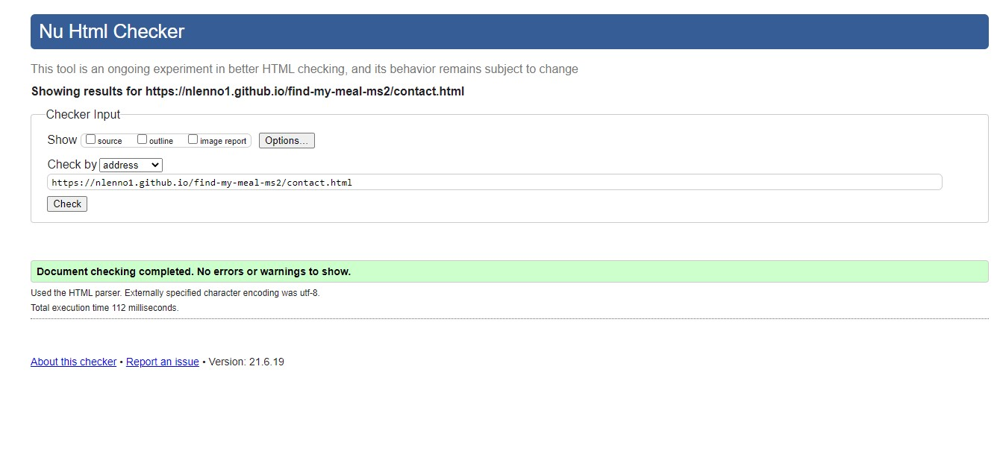
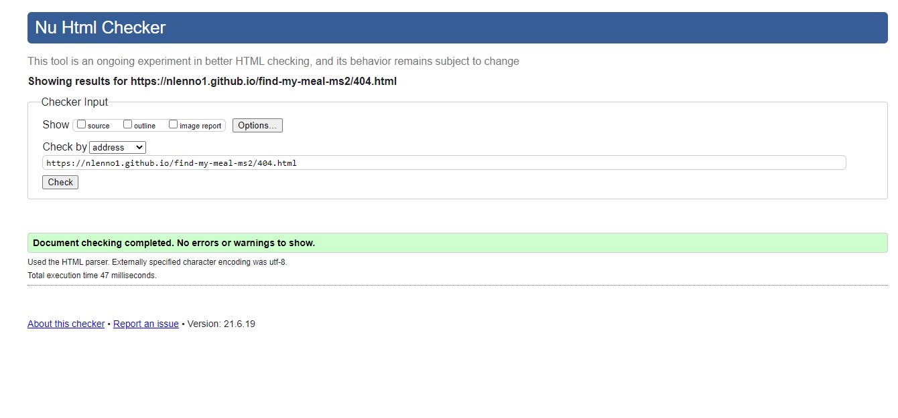
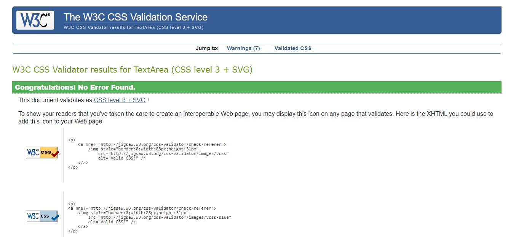
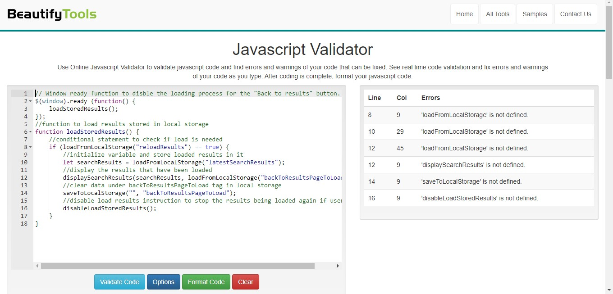
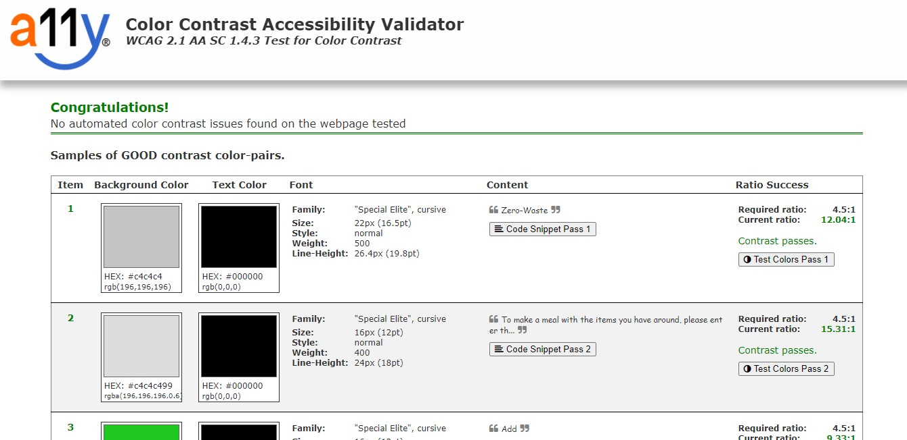

# Validation Results

### Google Lighthouse Results

### HTML Validation Results

### CSS Validation Results

### Java Script Validation Results
create-page.js

footer-position.js

index.js

item-control.js

load-results.js

lucky-dip.js

recipe-display.js

send-email.js

### Color Validation Results

### Mobile Compatability Results

